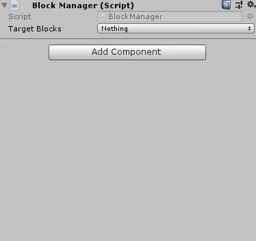
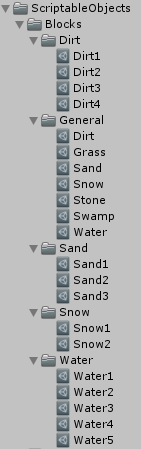

# ScriptableObjectMultiSelectDropdown
ScriptableObjectMultiSelectDropdown is an attribute for the Unity Inspector.
It is used for showing ScriptableObjects which are created in your project, in dropdown menu and select multiple of them in Inspector.



# Usage Example
1. Clone this repository or download the latest [release package available](https://github.com/ATHellboy/ScriptableObjectMultiSelectDropdown/releases) (There isn't an example folder in `.unitypackage`).

2. Create `ScriptableObject` class which you  want to create specified objects by that.

```cs
using UnityEngine;

[CreateAssetMenu(menuName = "Create Block")]
public class Block : ScriptableObject
{
    // Some fields
}
```

3. Create ScriptableObjects in the project.



4. Use `ScriptableObjectMultiSelectDropdown` attribute by setting type of specified ScriptableObject derived class and optional grouping  (Default grouping is None) like this in `MonoBeahviour` or `ScriptableObject` derived classes.

**MonoBehavior**

```cs
using ScriptableObjectMultiSelectDropdown;
using UnityEngine;

public class BlockManager : MonoBehaviour
{
    // Without grouping (default is None)
    [ScriptableObjectMultiSelectDropdown(typeof(Block))]
    public ScriptableObjectReference firstTargetBlocks;
    // By grouping
    [ScriptableObjectMultiSelectDropdown(typeof(Block), grouping = ScriptableObjectGrouping.ByFolder)]
    public ScriptableObjectReference secondTargetBlocks;
}
```


**ScriptableObject**
```cs
using UnityEngine;
using ScriptableObjectMultiSelectDropdown;

[CreateAssetMenu(menuName = "Create Block Manager Settings")]
public class BlockManagerSettings : ScriptableObject
{
    // Without grouping (default is None)
    [ScriptableObjectMultiSelectDropdown(typeof(Block))]
    public ScriptableObjectReference firstTargetBlocks;
    // By grouping
    [ScriptableObjectMultiSelectDropdown(typeof(Block), grouping = ScriptableObjectGrouping.ByFolderFlat)]
    public ScriptableObjectReference secondTargetBlocks;
}
```


# License
MIT License

Copyright (c) 2019 Alireza Tarahomi

Permission is hereby granted, free of charge, to any person obtaining a copy
of this software and associated documentation files (the "Software"), to deal
in the Software without restriction, including without limitation the rights
to use, copy, modify, merge, publish, distribute, sublicense, and/or sell
copies of the Software, and to permit persons to whom the Software is
furnished to do so, subject to the following conditions:

The above copyright notice and this permission notice shall be included in all
copies or substantial portions of the Software.

THE SOFTWARE IS PROVIDED "AS IS", WITHOUT WARRANTY OF ANY KIND, EXPRESS OR
IMPLIED, INCLUDING BUT NOT LIMITED TO THE WARRANTIES OF MERCHANTABILITY,
FITNESS FOR A PARTICULAR PURPOSE AND NONINFRINGEMENT. IN NO EVENT SHALL THE
AUTHORS OR COPYRIGHT HOLDERS BE LIABLE FOR ANY CLAIM, DAMAGES OR OTHER
LIABILITY, WHETHER IN AN ACTION OF CONTRACT, TORT OR OTHERWISE, ARISING FROM,
OUT OF OR IN CONNECTION WITH THE SOFTWARE OR THE USE OR OTHER DEALINGS IN THE
SOFTWARE.
